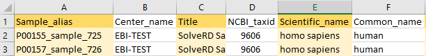
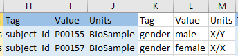
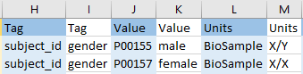
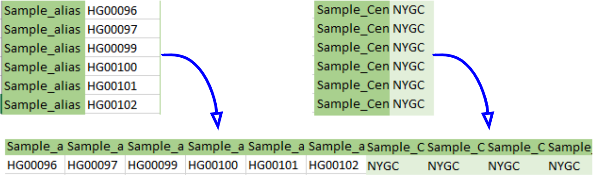
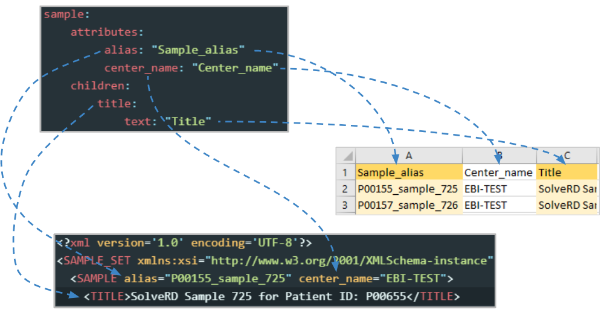
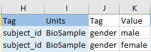

# Star2xml
## Index
1. [Overview](#Overview)
2. [Usage](#Usage)

    2.1. [Pre-requisites](#Pre-requisites)

    2.2. [Scripts](#Scripts): [``star2xml.py``](#star2xml.py) and [``validateXML.py``](#validateXML.py)
    
    2.3. [Mock examples](#Mock-examples)
3. [Filling out templates](#Filling-out-templates)
4. [Configuration files](#Configuration-files)
5. [Common issues](#Common-issues)
## Overview
The Star2xml tool eases the process of XML creation prior metadata submission to the European Genome-phenome Archive (EGA).
* **What?**
    * A compilation of Python scripts that automatically generate correctly formatted XMLs containing metadata. Additionally it can validate such XMLs against [ENA's schemas](https://github.com/enasequence/schema/tree/master/src/main/resources/uk/ac/ebi/ena/sra/schema) (`.xsd` files).
* **How?**
    * Given an **input file** (`.csv`, `.tsv` or `.xlsx`) the tool follows an XML structure (defined in a `YAML` [schema file](configuration_files/xml_schema.yaml)) assigning each field of the input file to its corresponding XML node's characteristics.
* **Where?**
    * Tool's scripts can be found in [Star2xml directory](./).
    * Required Python packages can be found at [requirements.txt](requirements.txt).
    * Use the file [``EGA_metadata_submission_template_v1.xlsx``](../templates/sequence-based-metadata/EGA_metadata_submission_template_v1.xlsx) as a template to fill in with your data, which can be used as the input for the Star2xml tool. Further information about its format and how to fill each of their tabs exists in [its section](#Filling-out-templates) on this README.
    * Configuration files (`input_configuration.yaml` and `xml_schema.yaml`) reside in the [configurations directory](configuration_files/). Information regarding their structure and how to modify them is located both within the files themselves and [their section](#Configuration-files) on this README.


We highly recommend you to take a look at the recorded session "[Star2xml: metadata converter](https://embl-ebi.cloud.panopto.eu/Panopto/Pages/Viewer.aspx?id=58d299c7-7e25-4b48-8fc3-ad18011ef0b4)", where we go through an overview of what the basic usage of the tool is and how to use it. Likewise, there is a second video tutorial that covers the [programmatic submission](https://embl-ebi.cloud.panopto.eu/Panopto/Pages/Viewer.aspx?id=497e5189-5883-4290-941b-ad2800af6636) that follows the creation of metadata XMLs. 

Currently **only metadata from Sequence data** (_e.g._ whole genome sequencing) **can be processed through star2xml**, while Array Format (AF) submissions have their own bespoken [procedures](https://ega-archive.org/submission/array_based/metadata) and [templates](https://github.com/EbiEga/ega-metadata-schema/blob/8dca24c694b0c005f1b0d665f1c6900e766f38d7/templates/array-based-metadata/EGA_Array_based_Format_V4.3.xlsx).
## Usage
### Pre-requisites
This tool was programmed in **Python** (**version 3.8+**) and depends on the following packages:


| Package        | Version  | Description  |
| -------------: |:-------------|:-------------|
| pandas | 1.2.2 | Fast, powerful, flexible and easy to use open source data analysis and manipulation tool |
| PyYAML  | 5.4.1 | YAML parser and emitter |
| argparse | 1.4.0 | Module to write user-friendly command-line interfaces |
| lxml | 4.6.2 | library for processing XML and HTML |
| datetime | 4.3 | Supplies classes for manipulating dates and times |
| openpyxl | 3.0.6 | Python library to read/write Excel 2010 xlsx/xlsm/xltx/xltm files |
| requests | 2.25.1 | HTTP library for Python (used to download files) |

You may want to install the latest versions of this packages and check if it works (running the [mock command line examples](#Mock-examples) provided in this README). In case you want to install the specific versions we used to develop this tool, you are advised to create a **virtual environment** (to avoid overwriting other versions you may use).

To install Python dependencies:
```bash
# Step 1. Cloning the tools repository
git clone https://github.com/EbiEga/ega-metadata-schema.git
cd ega-metadata-schema/Star2xml/
# Step 2. Creating and activating the virtual environment
virtualenv -p python3 venv_star2xml
source venv_star2xml/bin/activate
# Step 3. Installing dependencies
pip3 install -r requirements.txt
# Step 4. Deactivating the virtual environment
deactivate
```
If you wish to install dependencies on your working environment, you will only need to run the two commands from steps 1 and 3 (skip steps 2 and 4). In case you do create a virtual environment, remember to always activate it (using `source venv_star2xml/bin/activate`) prior running the scripts.

### Scripts
There are two main scripts you can run:
* **star2xml.py**: used to **generate** XMLs.
* **validateXML.py**: used to **validate** XMLs.

Information of both scripts can be obtained using the command line help option [`-h`] (_e.g._ `./star2xml.py -h`) while executing each of them.

### star2xml.py
```
usage: star2xml.py [-h] [--output_xmls OUTPUT_XMLS] [--schema-file [SCHEMA_FILE]] [--configuration-file [CONF_FILE]] [--verbose] [--debug] [--validate] schema_keys input_file

A script to transform an input file (.csv, .tsv or .xlsx) into one (or more) dataframe(s), and then build one (or more) XML(s) with its information following the XML structure described in a YAML file

positional arguments:
  schema_keys           Schema keys for the metadata object. Can be a single key (e.g. "sample", "run", "experiment"...), or several keys separated by commas (e.g. "sample,run,experiment")
  input_file            Input file (.csv, .tsv or .xlsx) with metadata information to be transformed into a dataframe (e.g. "sample.xlsx"). If several schema keys are given, the input spreadsheet is expected to have a separated tab
                        named after each schema key.

optional arguments:
  -h, --help            show this help message and exit
  --output_xmls OUTPUT_XMLS
                        Output XML filepaths, i.e. file(s) that will contain the generated XML(s). [OUTPUT_XMLS] can be (1) a single filepath (e.g. "sample.xml"), (2) several filepaths separated by commas (e.g.
                        "sample.xml,run.xml,experiment.xml" - in the same order as the schema keys), (3) or a directory (default: "output_xmls/") where all XMLs will be saved with their corresponding schema keys as their names (with
                        the time-stamp if needed to avoid overwritting files).
  --schema-file [SCHEMA_FILE]
                        YAML file containing the schema for the metadata object(s) (default: "xml_schema.yaml")
  --configuration-file [CONF_FILE]
                        YAML file containing the configuration (i.e. required fields) of the input file (default: "input_configuration.yaml")
  --verbose             A boolean switch to add verbosity to the function (printing initial parameters, final XML...)
  --debug               A boolean switch to set the functions in "debug" mode, which will add even more verbosity to the function (printing every step of the XML creation...)
  --validate            A boolean switch that will enable the validation of the scripts right after its creation. Thus, the function will call validateXML.py (in verbose mode) after it has finished creating the XMLs.

Example of usage: $ ./star2xml.py "study,sample,analysis,experiment,run,dataset,submission,dac,policy" "../templates/sequence-based-metadata/EGA_metadata_submission_template_v1.xlsx" --validate
```

The **input file** will commonly be a **spreadsheet** with a tab named after each of the metadata objects (_e.g._ "run") we want to convert into XMLs. Instead of a joint spreadsheet, the tool also accepts **Comma and Tab Separated Values** (.csv and .tsv) files, each of which would contain data of one single metadata object (similar to one tab of the joint template). 

For example, the joint template ([``EGA_metadata_submission_template_v1.xlsx``](../templates/sequence-based-metadata/EGA_metadata_submission_template_v1.xlsx)) contains a tab for each possible metadata object. Within each of them, one row corresponds to one metadata instance (_e.g._ one ``run`` per row), and each column to one field of information for such instance. In case we were interested in creating an XML containing the Run's metadata we would execute the following command:

``` Bash
./star2xml.py  'run' '../templates/sequence-based-metadata/EGA_metadata_submission_template_v1.xlsx' --output_xmls 'output_xmls/run.xml' --schema-file 'configuration_files/xml_schema.yaml' --configuration-file 'configuration_files/input_configuration.yaml'
```
Both `--schema-file` and `--configuration-file` arguments can be omitted if their corresponding filepaths have not been modified (by default in `configuration_files/`). Besides, if `--output_xmls` is also omitted, the output XMLs will be stored in `output_xmls/` by default. Thus, the command can be simplified:
``` Bash
./star2xml.py  'run' '../templates/sequence-based-metadata/EGA_metadata_submission_template_v1.xlsx'
```
One convenient optional argument that you can provide to the ``star2xml.py`` script is `--validate`, which will trigger the execution of the following script. In other words, this will not only create the desired XMLs, but also validate them against ENA's schemas with one single command.

### validateXML.py
```
usage: validateXML.py [-h] [--schemas-dir [SCHEMA_DIR]] [--schema-file [SCHEMA_FILE]] [--download_xsd] [--ftp_downloader] [--verbose] [--dont_stop_parsing] schema_keys input_xmls

A script to validate one (or more) input XML(s) based on some XML schemas (.xsd files). If schemas are missing, it downloads them from its GH repository (or FTP server) (specified within the configuration files). The function returns a list of boolean values defined by the outcome of the validation (e.g. [False, True, True] if only the last 2 XMLs were correctly validated)

positional arguments:
  schema_keys           Schema key(s) (comma delimited) for the metadata object(s) (e.g. "sample,run" or "experiment"...)
  input_xmls            Input XML(s) (comma delimited) with metadata information to be validated (e.g. "sample.xml,run.xml" or "experiment.xml")

optional arguments:
  -h, --help            show this help message and exit
  --schemas-dir [SCHEMA_DIR]
                        Directory containing all the XSD schema files (default: "downloaded_schemasXSD/"). If --download-xsd is given, the XSD files will be downloaded into this directory.
  --schema-file [SCHEMA_FILE]
                        YAML file containing the schema for the metadata object(s) (default: "configuration_files/xml_schema.yaml")
  --download_xsd        A boolean switch that will enable the download of the XML schemas (.xsd files) instead of having to provide them manually.
  --ftp_downloader      A boolean switch to use the ftp downloader instead of the default request.get() downloader for the ENA schemas (in GitHub), which is the main source of truth for ENA schemas. We advise you not to use this option
                        unless you know for sure that the version of the schemas within the configuration files (e.g. 'pub/databases/ena/doc/xsd/sra_1_6/') is the proper one.
  --verbose             A boolean switch to add verbosity to the function (will print into the terminal extra information, as well as the validation errors and results with a friendlier format). Highly recommended.
  --dont_stop_parsing   A boolean switch that, if given, will make the validation continue if an error is raised when parsing one of the given XMLs. Such file with errors will be reported as not validated, but the function will not
                        stop, validating other files. The error will be displayed excplicitly as a warning if '--verbose' is also given.

Schema keys (e.g. 'sample,run') and their input XMLs (e.g. 'sample.xml,run.xml') have to be given in the same order!
```
Just like with the previous script, here we can validate as many XML files as we want in one go. For instance, in the following example we validate two XML files (`sample.xml` and `run.xml`) that correspond to two different metadata objects (`sample` and `run`). It is important to notice that, if we have not downloaded yet the metadata schema files (`.xsd`), we should provide the option `--download_xsd` the first time we run `validateXML.py`.
```Bash
./validateXML.py "sample,run" "output_xmls/sample.xml,output_xmls/run.xml" --schemas-dir "downloaded_schemasXSD/" --schema-file "configuration_files/xml_schema.yaml" --verbose --download_xsd
```
Once again, if we have not modified the schema's filepath, option `--schema-file` can be omitted. Besides, `--schemas-dir` is by default `downloaded_schemasXSD/` and if we already downloaded the `.xsd` files, we can also omit the option `--download_xsd`. Thus, a simpler command would be:
```Bash
./validateXML.py "sample,run" "output_xmls/sample.xml,output_xmls/run.xml" --verbose
```
It is worth mentioning that if there is an error while parsing the given XMLs (_e.g._ there are unclosed nodes - _i.e._ missing '`>`'), the validation will stop by default to notify the error. If this is not the desired behaviour, you may provide the optional argument `--dont_stop_parsing` to avoid terminating the execution, and instead report the file with errors as non-validated.

### Mock examples
To get started with the tool, you can execute the following commands:

```Bash
# Create one single XML from one tab of the joint spreadsheet:
./star2xml.py "sample" "../templates/sequence-based-metadata/EGA_metadata_submission_template_v1.xlsx" --verbose

# Validate the XML we just created:
./validateXML.py "sample" "output_xmls/sample.xml" --verbose --download_xsd

# Create all possible XMLs from the joint template and validate each of them:
./star2xml.py "study,sample,analysis,experiment,run,dataset,submission,dac,policy" "../templates/sequence-based-metadata/EGA_metadata_submission_template_v1.xlsx" --validate
```

## Filling out templates
For this part of the documentation we will be using the joint template ([``EGA_metadata_submission_template_v1.xlsx``](../templates/sequence-based-metadata/EGA_metadata_submission_template_v1.xlsx)), a spreadsheet, since it is the most commonly used format. Nevertheless, stripping off the formatting, you may use a similar logic while filling plain text formats (``.csv`` and ``.tsv``)

Based on the type of metadata objects you want to submit, you shall **fill their corresponding tabs** within such joint template. Each tab of the spreadsheet corresponds to one of the possible metadata objects (_e.g._ ``run``) from EGA, with the exception of the first tab, which is named ``Readme`` and contains information about the file's format. For all metadata tabs **each row will represent one repetition of a metadata object**. For example, each of the rows in the sample tab given as input will represent one ``<SAMPLE>`` node of the ``<SAMPLE_SET>`` in the final XML. All information that row contains will be associated with its corresponding ``<SAMPLE>`` node (its alias, description, etc.). 

Rows that are completely empty will be discarded, as well as empty values within a non-empty row. In other words, **every empty coordinate of the spreadsheet that is not filled will not appear in the output XML**. 

Please bear in mind that controlled vocabularies (CV - e.g. ``SEQUENCE_VARIATION`` as an Analysis type) are case-sensitive (i.e. ``Sequence_variation`` is considered a different CV). 

### Row's format

It is important to notice the rows format:
* **First row**: **column headers**.
* **Second row**: **descriptive row**. In here you will find what type of data corresponds to each column. Most values within this row will start with "TODO:…", which means that the data its column contains is specific to your case. In case its value does not start in such a way, it means that the string this row contains for that specific column shall be used for all rows (_e.g._ ``MD5`` at ``Checksum_method`` within an analysis tab or ``sex`` at one of the ``Tag`` columns of a sample tab).
* **Third row**: **real data "ceiling"**. It is below this row (at the fourth row) that you shall enter your real metadata. 
* **Fourth row onwards**: **real metadata**. All rows from the 4th onwards will be transformed into XML nodes by the star2xml tool. By default the template will contain some mock examples within this row so that you can execute the above mentioned [mock commands](#Mock-examples), but you shall **remove this whole row or replace its values with yours**. 

### Types of columns

Before filling the template, we need to recognize **two** different types of columns: **non-repetitive** and **repetitive** ones. 

1. **Non-repetitive columns**. These fields describe a characteristic (text or attribute) of **one single node** (_e.g._ `text: "Scientific_name"`) **for each metadata object** (_e.g._ ``<SAMPLE>``). Such columns can be hidden or left empty for some or all rows (unless required - see [column headers' format](#Column-header's-format) below), but **should not be deleted** (the tool will be looking for them). As an example, in the following image we have 5 of these columns from the analysis tab. 



2. **Repetitive columns**. These fields contain characteristics for **a node that can be repeated** (_e.g._ ``<SAMPLE_ATTRIBUTE>`` or ``<FILE>``) **within each metadata object** (_e.g._ ``<SAMPLE>`` or ``<ANALYSIS>``). These repeated columns are differently coloured (see [column's format](#Column-header's-format) below) and appear beyond a vertical thick black line (with the exception of ``subject_id``, ``sex`` and ``phenotype`` - the three public attributes from a sample tab). The important thing to notice is that the alternative colouring is there to help you identify what a "repetitive block" is. In the following image we have 9 of these columns, which correspond to 3 repetitions of the same ***repetitive block*** (in this case ``Tag-Value-Units``). These blocks can be added or deleted depending on your needs, but if there is a column from a repetitive block, their sibling columns are also required (even if left empty or hidden, just like ``Units`` for ``subject_id``, ``sex`` and ``phenotype``): in our example, if we add a new repetition with columns ``Tag`` and ``Value``, there needs to be a third one, ``Units``.  



Column names in the templates are **linked to the configuration files** (`input_configuration.yaml` and `xml_schema.yaml`), which leads to an important constraint: if there is a field described in a configuration file (_e.g._ ``center_name: "Center_name"``) there **needs** to be its corresponding column name within the input file (_e.g._ `Center_name`). In other words, unless the configuration file is properly modified, you shall not delete *non-repetitive columns* or completely delete all *repetitive blocks* from the input file. What you can do is leave them empty for some or all rows, or delete additional repetitive blocks that you don't need. At least one of each complete repetitive block (with all its sibling fields) needs to be present within the input file, even if you leave it empty for some or all rows. As we mentioned before, every empty coordinate of the spreadsheet will not be entered in the XML.

The **order of columns is not relevant** as long as the repeated blocks' columns are not severely mixed (_e.g._ filling first `Tag` with the string corresponding to the second `Tag`). In fact, repeated columns can be mixed provided the order is maintained, thus making the following input valid.



This allows for a handy way of dealing with **hundreds or thousands of columns** in an easy way (being able to put all columns of the same type in a sequence). For instance, we may want to generate an Analysis XML based on our samples, but the analysis encompasses thousand of samples (*i.e.* thousands of rows in the sample tab, but thousands of columns in the analysis tab). Although there are multiple ways to input such columns, an easy approach is to use the **transpose function** (_e.g._ using excel - [help from microsoft](https://support.microsoft.com/en-us/office/transpose-rotate-data-from-rows-to-columns-or-vice-versa-3419f2e3-beab-4318-aae5-d0f862209744)). In our example the sample repetitive block contains 2 types of columns (``Sample_alias`` and ``Sample_Label``). Therefore, we can copy all the aliases from the sample tab (rows), and transpose them as columns into the analysis tab, do the same with the labels, and create the following input:


### Column header's format

Additional information can be obtained from the colour of the column headers (first row):

* Bright yellow: **required attributes**. All column headers that contain "``*``" are marked as required (_e.g._ ``Analysis_alias*``): their metadata shall be provided for each filled row.
* No colour: **optional** (yet highly recommended) **attributes**. These columns may be left empty, although we advise to also provide their corresponding metadata, for it will enrich your submission.
* Light yellow: **optionally required columns**. These are columns related to a choice from another column (based on multiple choice attributes). For instance, if our experiment's layout is ``PAIRED``, the two related columns (``PAIRED.Nominal_length`` and ``PAIRED.Nominal_sdev``) will change their header's format to light yellow, since these are required columns for a paired experiment.
* Grey: **optionally ignored columns**. Column headers that do not appear to be chosen for any metadata instance (row), and thus can be ignored (_i.e._ left empty) (based on multiple choice attributes). For instance, if our experiment's layout is ``SINGLE``, the two columns previously mentioned that are related to a paired experiment would be highlighted in grey. 
* Other colours: **repetition blocks**. As we mentioned describing the [types of columns](#Types-of-columns), there are repeated columns. Their headers are alternatively coloured for each repeated class to ease their identification. Besides, the body of the column is coloured in a lighter colour than their headers alternating between *repeated blocks* of the same class. 


## Configuration files

This section of the README displays additional information about how the tool works using their configuration files. Such knowledge will most likely not be relevant to the average user, and thus **you may skip it**. Nevertheless, if you wish to change the configuration files, it will come in handy. 

There are **two configuration files**: `input_configuration.yaml` and ``xml_schema.yaml``. The former simply **lists the required fields for each input file** (_i.e._ if a column named ``Sample_alias*`` needs to be present or not). The latter **describes the structure of the corresponding XML** (_i.e._ which nodes are children of which) and **associates each column name of the input file with its corresponding node's characteristic** (either an attribute or text). Both are `YAML` files, which are easy-to-read information holders, and can be interpreted as dictionaries/lists of elements. Besides the information displayed here, additional instructions on how to modify them reside within the files themselves.

### Basic structure - ``xml_schema.yaml``
At base level, the file contains **information of the tool itself** (`tool_info` - used to add details to reports), the **metadata schemas** (`XML_schemas_info` - used to both download `.xsd` files and create XMLs) and **one element for each metadata object** (_e.g._ `sample`) describing its XML's architecture.

A simple example of *what is what*, with content from the `xml_schema.yaml` (_up_), the input file (_right_) and the output XML (_down_), is the following:



### Modifying the schema
If the metadata requirements change and existing fields need to be removed or new ones added, we will need to modify the two configuration files as well as the input files.


##  Common issues 

* **Missing fields of a repetitive block**. In the following example fields ``Value`` and ``Units`` are missing from the first and second ``Tag-Value-Units`` (one of the common *repetition blocks*), respectively. Remember that repeated blocks need to be complete (if there is a ``Tag`` column, its two siblings ``Value`` and ``Units`` need to be there), but you can leave empty such columns for all or some rows, since every empty coordinate of the spreadsheet will be ignored. 



* **Not using** the option `--download_xsd` the first time you try to validate XMLs: the schemas (`.xsd`) will be missing and the tool will throw the following error message:
``` Bash
ERROR in check_xml_is_valid(): the schema file 'downloaded_schemasXSD/SRA.sample.xsd' could not be accessed. If you have not downloaded the schema files (.xsd) yet, use '--download_xsd' when running the command.
```
* **Line endings being an issue**. When using different operating systems (e.g. using Windows Subsystem for Linux) an issue regarding line endings may arise when trying to execute the scripts (_e.g._ `/usr/bin/env: ‘python3\r’: No such file or directory` - notice the `/r` not being handled correctly by the interpreter). If such is the case, there are automatic ways to change all line endings within the scripts, which will solve the issue:
``` bash
sudo apt install dos2unix
# Within the 'Star2xml/' folder do:
dos2unix ./*.py
```
* **File permissions not being stablished by default**. In case executable files (e.g. ``star2xml.py``) are not executable by your user (take a look at its permissions - e.g. ``-rw-r--r--``), you will need to amend them manually (e.g. ``chmod u+x star2xml.py``).