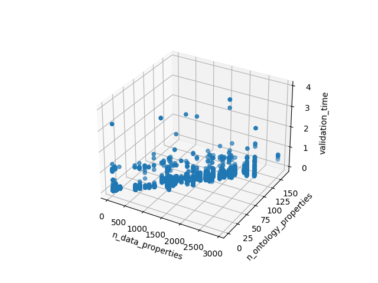
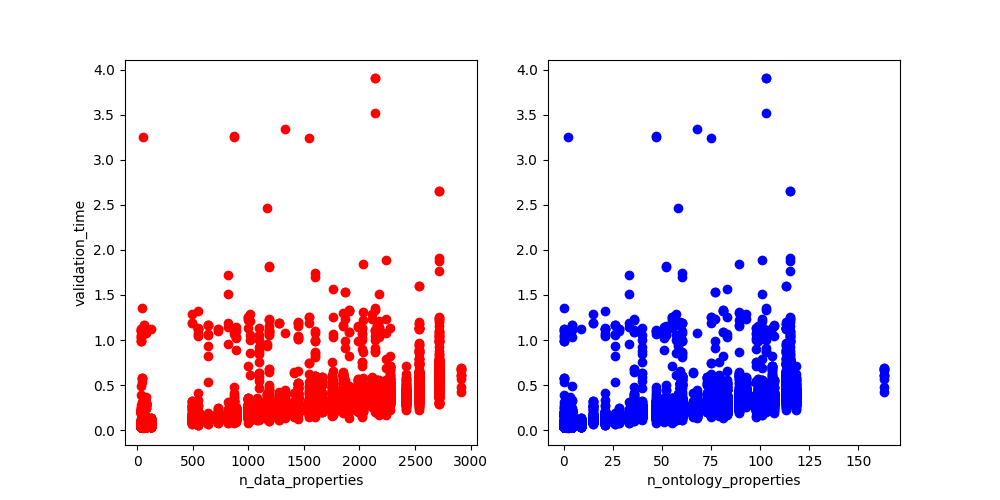
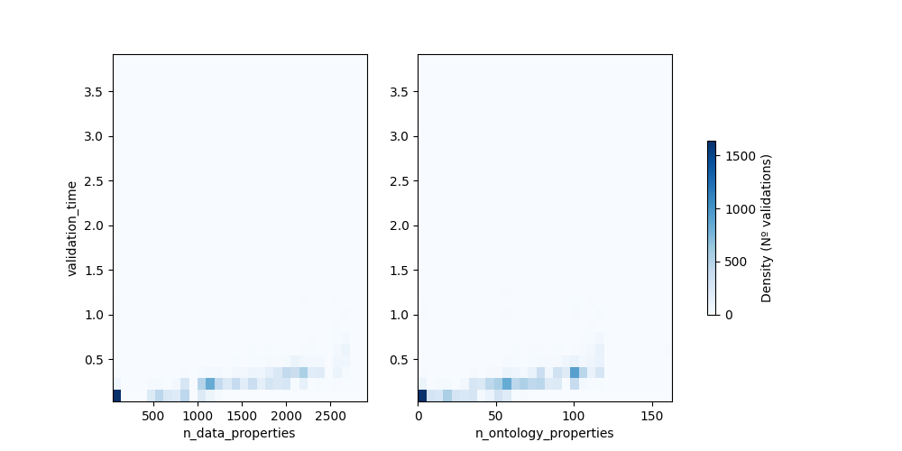

# JSON validation summary
The script [``create_benchmarks.py``](https://github.com/EbiEga/ega-metadata-schema/blob/main/.github/scripts/create_benchmarks.py) validated all JSON files in a directory against a validation server endpoint, recording valuable parameters of its execution.
Overall execution parameters:
| Date                | Passed validation   |   Validation time (s) | Input directory                  | Used endpoint                              |   Nº of executions |   Nº of files |   Nº of properties |   Nº of ontology validations |
|:--------------------|:--------------------|----------------------:|:---------------------------------|:-------------------------------------------|-------------------:|--------------:|-------------------:|-----------------------------:|
| 2023-01-23 19:04:19 | True                |                2948.2 | 2023.01.23_benchmarks/json_docs/ | http://biovalidator.ega.ebi.ac.uk/validate |                250 |            48 |           15317076 |                       695043 |

All files generated in this execution are stored in this directory (``2023.01.23_benchmarks/EGAs_endpoint``) with this same README. These files are:
1. Two CSV files: the complete set of validation parameters for each file and validation attempt ([``2023.01.23_benchmarks/EGAs_endpoint/complete_df.csv``](summary_df.csv)) and a summary of those ([``2023.01.23_benchmarks/EGAs_endpoint/summary_df.csv``](summary_df.csv)), also displayed below.
2. Three graphs (all inserted below) of the full set of parameters: a 3D graph ([``2023.01.23_benchmarks/EGAs_endpoint/3D_scatterPlot.png``](3D_scatterPlot.png)) of the validation time, number of properties, and number of ontology validations; two 2D scatter subplots ([``2023.01.23_benchmarks/EGAs_endpoint/2D_scatterPlot.png``](2D_scatterPlot.png)) of the validation time versus the other two variables; and a 2D density plot ([``2023.01.23_benchmarks/EGAs_endpoint/2D_densityPlots.png``](2D_densityPlots.png)) containing 2 subplots: one for each variable versus the validation time

Graphical representations:

Summary table:
| filepath                                                      | Passed validation   |   Average validation time |   Number of JSON properties per file |   Number of ontology validations per file |   Number of validations |
|:--------------------------------------------------------------|:--------------------|--------------------------:|-------------------------------------:|------------------------------------------:|------------------------:|
| 2023.01.23_benchmarks/json_docs/DAC_valid-1.json              | True                |                 0.0750346 |                                   42 |                                         0 |                     250 |
| 2023.01.23_benchmarks/json_docs/analysis_valid-1.json         | True                |                 0.0754305 |                                   85 |                                         3 |                     250 |
| 2023.01.23_benchmarks/json_docs/assay_valid-1_array.json      | True                |                 0.0802813 |                                   57 |                                         2 |                     250 |
| 2023.01.23_benchmarks/json_docs/assay_valid-2_sequencing.json | True                |                 0.0666234 |                                   61 |                                         4 |                     250 |
| 2023.01.23_benchmarks/json_docs/dataset_valid-1.json          | True                |                 0.100715  |                                   36 |                                         0 |                     250 |
| 2023.01.23_benchmarks/json_docs/experiment_valid-1.json       | True                |                 0.0623042 |                                  127 |                                         9 |                     250 |
| 2023.01.23_benchmarks/json_docs/individual_valid-1.json       | True                |                 0.0694486 |                                   40 |                                         4 |                     250 |
| 2023.01.23_benchmarks/json_docs/object-set_benchmark_10.json  | True                |                 0.140539  |                                  491 |                                        15 |                     250 |
| 2023.01.23_benchmarks/json_docs/object-set_benchmark_11.json  | True                |                 0.133375  |                                  550 |                                        21 |                     250 |
| 2023.01.23_benchmarks/json_docs/object-set_benchmark_12.json  | True                |                 0.133193  |                                  548 |                                        21 |                     250 |
| 2023.01.23_benchmarks/json_docs/object-set_benchmark_13.json  | True                |                 0.144406  |                                  640 |                                        26 |                     250 |
| 2023.01.23_benchmarks/json_docs/object-set_benchmark_14.json  | True                |                 0.175272  |                                  890 |                                        51 |                     250 |
| 2023.01.23_benchmarks/json_docs/object-set_benchmark_15.json  | True                |                 0.159697  |                                  818 |                                        33 |                     250 |
| 2023.01.23_benchmarks/json_docs/object-set_benchmark_16.json  | True                |                 0.148518  |                                  727 |                                        28 |                     250 |
| 2023.01.23_benchmarks/json_docs/object-set_benchmark_17.json  | True                |                 0.190897  |                                 1015 |                                        57 |                     250 |
| 2023.01.23_benchmarks/json_docs/object-set_benchmark_18.json  | True                |                 0.18111   |                                 1083 |                                        51 |                     250 |
| 2023.01.23_benchmarks/json_docs/object-set_benchmark_19.json  | True                |                 0.219297  |                                  875 |                                        47 |                     250 |
| 2023.01.23_benchmarks/json_docs/object-set_benchmark_20.json  | True                |                 0.219756  |                                  996 |                                        55 |                     250 |
| 2023.01.23_benchmarks/json_docs/object-set_benchmark_21.json  | True                |                 0.22695   |                                 1165 |                                        58 |                     250 |
| 2023.01.23_benchmarks/json_docs/object-set_benchmark_22.json  | True                |                 0.230834  |                                 1185 |                                        52 |                     250 |
| 2023.01.23_benchmarks/json_docs/object-set_benchmark_23.json  | True                |                 0.229801  |                                 1101 |                                        40 |                     250 |
| 2023.01.23_benchmarks/json_docs/object-set_benchmark_24.json  | True                |                 0.206535  |                                 1186 |                                        47 |                     250 |
| 2023.01.23_benchmarks/json_docs/object-set_benchmark_25.json  | True                |                 0.230811  |                                 1275 |                                        60 |                     250 |
| 2023.01.23_benchmarks/json_docs/object-set_benchmark_26.json  | True                |                 0.243527  |                                 1328 |                                        68 |                     250 |
| 2023.01.23_benchmarks/json_docs/object-set_benchmark_27.json  | True                |                 0.232194  |                                 1410 |                                        66 |                     250 |
| 2023.01.23_benchmarks/json_docs/object-set_benchmark_28.json  | True                |                 0.243884  |                                 1190 |                                        36 |                     250 |
| 2023.01.23_benchmarks/json_docs/object-set_benchmark_29.json  | True                |                 0.288286  |                                 1549 |                                        75 |                     250 |
| 2023.01.23_benchmarks/json_docs/object-set_benchmark_30.json  | True                |                 0.298562  |                                 1765 |                                        83 |                     250 |
| 2023.01.23_benchmarks/json_docs/object-set_benchmark_31.json  | True                |                 0.30323   |                                 1450 |                                        59 |                     250 |
| 2023.01.23_benchmarks/json_docs/object-set_benchmark_32.json  | True                |                 0.334274  |                                 1851 |                                        89 |                     250 |
| 2023.01.23_benchmarks/json_docs/object-set_benchmark_33.json  | True                |                 0.317785  |                                 1601 |                                        60 |                     250 |
| 2023.01.23_benchmarks/json_docs/object-set_benchmark_34.json  | True                |                 0.27847   |                                 1661 |                                        73 |                     250 |
| 2023.01.23_benchmarks/json_docs/object-set_benchmark_35.json  | True                |                 0.295343  |                                 1752 |                                        79 |                     250 |
| 2023.01.23_benchmarks/json_docs/object-set_benchmark_36.json  | True                |                 0.319031  |                                 1983 |                                        99 |                     250 |
| 2023.01.23_benchmarks/json_docs/object-set_benchmark_37.json  | True                |                 0.336457  |                                 1905 |                                        81 |                     250 |
| 2023.01.23_benchmarks/json_docs/object-set_benchmark_38.json  | True                |                 0.332971  |                                 2027 |                                        98 |                     250 |
| 2023.01.23_benchmarks/json_docs/object-set_benchmark_39.json  | True                |                 0.349748  |                                 2236 |                                       101 |                     250 |
| 2023.01.23_benchmarks/json_docs/object-set_benchmark_40.json  | True                |                 0.3065    |                                 1873 |                                        77 |                     250 |
| 2023.01.23_benchmarks/json_docs/object-set_benchmark_41.json  | True                |                 0.344992  |                                 2154 |                                       107 |                     250 |
| 2023.01.23_benchmarks/json_docs/object-set_benchmark_42.json  | True                |                 0.336721  |                                 2031 |                                        89 |                     250 |
| 2023.01.23_benchmarks/json_docs/object-set_benchmark_43.json  | True                |                 0.357555  |                                 2178 |                                       101 |                     250 |
| 2023.01.23_benchmarks/json_docs/object-set_benchmark_44.json  | True                |                 0.39345   |                                 2113 |                                        93 |                     250 |
| 2023.01.23_benchmarks/json_docs/object-set_benchmark_45.json  | True                |                 0.415787  |                                 2142 |                                       103 |                     250 |
| 2023.01.23_benchmarks/json_docs/object-set_benchmark_46.json  | True                |                 0.370873  |                                 2420 |                                       118 |                     250 |
| 2023.01.23_benchmarks/json_docs/object-set_benchmark_47.json  | True                |                 0.399513  |                                 2276 |                                       106 |                     250 |
| 2023.01.23_benchmarks/json_docs/object-set_benchmark_48.json  | True                |                 0.515122  |                                 2533 |                                       113 |                     250 |
| 2023.01.23_benchmarks/json_docs/object-set_benchmark_49.json  | True                |                 0.650996  |                                 2719 |                                       115 |                     250 |
| 2023.01.23_benchmarks/json_docs/object-set_benchmark_50.json  | True                |                 0.60701   |                                 2916 |                                       163 |                      11 |