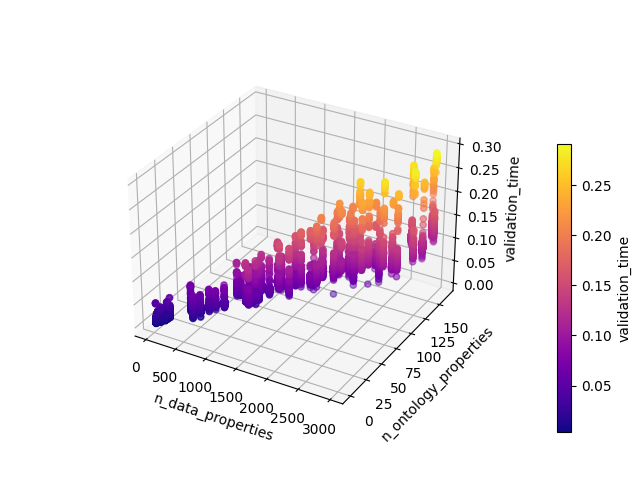
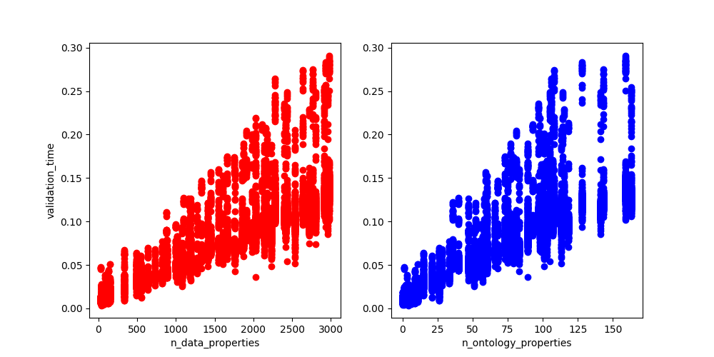
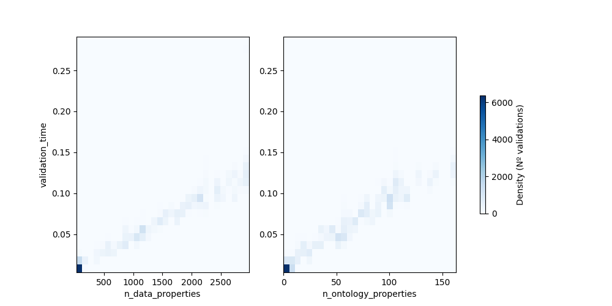

# JSON validation summary
The script [``create_benchmarks.py``](https://github.com/EbiEga/ega-metadata-schema/blob/main/.github/scripts/create_benchmarks.py) validated all JSON files in a directory against a validation server endpoint, recording valuable parameters of its execution.
Overall execution parameters:
| Date                | Passed validation   |   Validation time (s) | Input directory                                                     | Used endpoint                  |   Nº of executions |   Nº of files |   Nº of properties |   Nº of ontology validations |
|:--------------------|:--------------------|----------------------:|:--------------------------------------------------------------------|:-------------------------------|-------------------:|--------------:|-------------------:|-----------------------------:|
| 2023-01-26 15:15:40 | True                |               2080.62 | ../../docs/biovalidator_benchmarks/2023.01.23_benchmarks/json_docs/ | http://localhost:3020/validate |                500 |            67 |           43506000 |                      1998000 |

All files generated in this execution are stored in this directory (``local_endpoint``) with this same README. These files are:
1. Two CSV files: the complete set of validation parameters for each file and validation attempt ([``local_endpoint/complete_df.csv``](complete_df.csv)) and a summary of those ([``local_endpoint/summary_df.csv``](summary_df.csv)), also displayed below.
2. Three graphs (all inserted below) of the full set of parameters: a 3D graph ([``local_endpoint/3D_scatterPlot.png``](3D_scatterPlot.png)) of the validation time, number of properties, and number of ontology validations where one can also appreciate the codependance between the number of properties and ontology validations; two 2D scatter subplots ([``local_endpoint/2D_scatterPlot.png``](2D_scatterPlot.png)) of the validation time versus the other two variables; and a 2D density plot ([``local_endpoint/2D_densityPlots.png``](2D_densityPlots.png)) containing 2 subplots: one for each variable versus the validation time

Graphical representations:

Summary table:
| filepath                                                                                                | Passed validation   |   Average validation time |   Number of JSON properties per file |   Number of ontology validations per file |   Number of validations |
|:--------------------------------------------------------------------------------------------------------|:--------------------|--------------------------:|-------------------------------------:|------------------------------------------:|------------------------:|
| ../../docs/biovalidator_benchmarks/2023.01.23_benchmarks/json_docs/DAC_valid-1.json                     | True                |                0.00984048 |                                   42 |                                         0 |                     500 |
| ../../docs/biovalidator_benchmarks/2023.01.23_benchmarks/json_docs/analysis_valid-1.json                | True                |                0.0120666  |                                   85 |                                         3 |                     500 |
| ../../docs/biovalidator_benchmarks/2023.01.23_benchmarks/json_docs/assay_valid-1_array.json             | True                |                0.0107161  |                                   57 |                                         2 |                     500 |
| ../../docs/biovalidator_benchmarks/2023.01.23_benchmarks/json_docs/assay_valid-2_sequencing.json        | True                |                0.0104318  |                                   61 |                                         4 |                     500 |
| ../../docs/biovalidator_benchmarks/2023.01.23_benchmarks/json_docs/dataset_valid-1.json                 | True                |                0.00943701 |                                   36 |                                         0 |                     500 |
| ../../docs/biovalidator_benchmarks/2023.01.23_benchmarks/json_docs/experiment_valid-1.json              | True                |                0.0132297  |                                  127 |                                         9 |                     500 |
| ../../docs/biovalidator_benchmarks/2023.01.23_benchmarks/json_docs/individual_valid-1.json              | True                |                0.0104623  |                                   40 |                                         4 |                     500 |
| ../../docs/biovalidator_benchmarks/2023.01.23_benchmarks/json_docs/object-set_Covid19.json              | True                |                0.0161131  |                                  120 |                                         9 |                     500 |
| ../../docs/biovalidator_benchmarks/2023.01.23_benchmarks/json_docs/object-set_RareDisease.json          | True                |                0.0174206  |                                  148 |                                        11 |                     500 |
| ../../docs/biovalidator_benchmarks/2023.01.23_benchmarks/json_docs/object-set_SingleCellSequencing.json | True                |                0.0247002  |                                  330 |                                        26 |                     500 |
| ../../docs/biovalidator_benchmarks/2023.01.23_benchmarks/json_docs/object-set_benchmark_10.json         | True                |                0.0304469  |                                  491 |                                        15 |                     500 |
| ../../docs/biovalidator_benchmarks/2023.01.23_benchmarks/json_docs/object-set_benchmark_11.json         | True                |                0.0290652  |                                  550 |                                        21 |                     500 |
| ../../docs/biovalidator_benchmarks/2023.01.23_benchmarks/json_docs/object-set_benchmark_12.json         | True                |                0.0358565  |                                  548 |                                        21 |                     500 |
| ../../docs/biovalidator_benchmarks/2023.01.23_benchmarks/json_docs/object-set_benchmark_13.json         | True                |                0.0322688  |                                  640 |                                        26 |                     500 |
| ../../docs/biovalidator_benchmarks/2023.01.23_benchmarks/json_docs/object-set_benchmark_14.json         | True                |                0.0428209  |                                  890 |                                        51 |                     500 |
| ../../docs/biovalidator_benchmarks/2023.01.23_benchmarks/json_docs/object-set_benchmark_15.json         | True                |                0.0386557  |                                  818 |                                        33 |                     500 |
| ../../docs/biovalidator_benchmarks/2023.01.23_benchmarks/json_docs/object-set_benchmark_16.json         | True                |                0.0394327  |                                  727 |                                        28 |                     500 |
| ../../docs/biovalidator_benchmarks/2023.01.23_benchmarks/json_docs/object-set_benchmark_17.json         | True                |                0.0445861  |                                 1015 |                                        57 |                     500 |
| ../../docs/biovalidator_benchmarks/2023.01.23_benchmarks/json_docs/object-set_benchmark_18.json         | True                |                0.0458007  |                                 1083 |                                        51 |                     500 |
| ../../docs/biovalidator_benchmarks/2023.01.23_benchmarks/json_docs/object-set_benchmark_19.json         | True                |                0.0544479  |                                  875 |                                        47 |                     500 |
| ../../docs/biovalidator_benchmarks/2023.01.23_benchmarks/json_docs/object-set_benchmark_20.json         | True                |                0.0499978  |                                  996 |                                        55 |                     500 |
| ../../docs/biovalidator_benchmarks/2023.01.23_benchmarks/json_docs/object-set_benchmark_21.json         | True                |                0.0585391  |                                 1165 |                                        58 |                     500 |
| ../../docs/biovalidator_benchmarks/2023.01.23_benchmarks/json_docs/object-set_benchmark_22.json         | True                |                0.050514   |                                 1185 |                                        52 |                     500 |
| ../../docs/biovalidator_benchmarks/2023.01.23_benchmarks/json_docs/object-set_benchmark_23.json         | True                |                0.0538434  |                                 1101 |                                        40 |                     500 |
| ../../docs/biovalidator_benchmarks/2023.01.23_benchmarks/json_docs/object-set_benchmark_24.json         | True                |                0.0548464  |                                 1186 |                                        47 |                     500 |
| ../../docs/biovalidator_benchmarks/2023.01.23_benchmarks/json_docs/object-set_benchmark_25.json         | True                |                0.0536401  |                                 1275 |                                        60 |                     500 |
| ../../docs/biovalidator_benchmarks/2023.01.23_benchmarks/json_docs/object-set_benchmark_26.json         | True                |                0.065768   |                                 1328 |                                        68 |                     500 |
| ../../docs/biovalidator_benchmarks/2023.01.23_benchmarks/json_docs/object-set_benchmark_27.json         | True                |                0.0669102  |                                 1410 |                                        66 |                     500 |
| ../../docs/biovalidator_benchmarks/2023.01.23_benchmarks/json_docs/object-set_benchmark_28.json         | True                |                0.0574934  |                                 1190 |                                        36 |                     500 |
| ../../docs/biovalidator_benchmarks/2023.01.23_benchmarks/json_docs/object-set_benchmark_29.json         | True                |                0.0782403  |                                 1549 |                                        75 |                     500 |
| ../../docs/biovalidator_benchmarks/2023.01.23_benchmarks/json_docs/object-set_benchmark_30.json         | True                |                0.072898   |                                 1765 |                                        83 |                     500 |
| ../../docs/biovalidator_benchmarks/2023.01.23_benchmarks/json_docs/object-set_benchmark_31.json         | True                |                0.0729213  |                                 1450 |                                        59 |                     500 |
| ../../docs/biovalidator_benchmarks/2023.01.23_benchmarks/json_docs/object-set_benchmark_32.json         | True                |                0.0822553  |                                 1851 |                                        89 |                     500 |
| ../../docs/biovalidator_benchmarks/2023.01.23_benchmarks/json_docs/object-set_benchmark_33.json         | True                |                0.0713104  |                                 1601 |                                        60 |                     500 |
| ../../docs/biovalidator_benchmarks/2023.01.23_benchmarks/json_docs/object-set_benchmark_34.json         | True                |                0.083712   |                                 1661 |                                        73 |                     500 |
| ../../docs/biovalidator_benchmarks/2023.01.23_benchmarks/json_docs/object-set_benchmark_35.json         | True                |                0.0753941  |                                 1752 |                                        79 |                     500 |
| ../../docs/biovalidator_benchmarks/2023.01.23_benchmarks/json_docs/object-set_benchmark_36.json         | True                |                0.0908734  |                                 1983 |                                        99 |                     500 |
| ../../docs/biovalidator_benchmarks/2023.01.23_benchmarks/json_docs/object-set_benchmark_37.json         | True                |                0.0944548  |                                 1905 |                                        81 |                     500 |
| ../../docs/biovalidator_benchmarks/2023.01.23_benchmarks/json_docs/object-set_benchmark_38.json         | True                |                0.0987303  |                                 2027 |                                        98 |                     500 |
| ../../docs/biovalidator_benchmarks/2023.01.23_benchmarks/json_docs/object-set_benchmark_39.json         | True                |                0.0881018  |                                 2236 |                                       101 |                     500 |
| ../../docs/biovalidator_benchmarks/2023.01.23_benchmarks/json_docs/object-set_benchmark_40.json         | True                |                0.0852608  |                                 1873 |                                        77 |                     500 |
| ../../docs/biovalidator_benchmarks/2023.01.23_benchmarks/json_docs/object-set_benchmark_41.json         | True                |                0.0997009  |                                 2154 |                                       107 |                     500 |
| ../../docs/biovalidator_benchmarks/2023.01.23_benchmarks/json_docs/object-set_benchmark_42.json         | True                |                0.095307   |                                 2031 |                                        89 |                     500 |
| ../../docs/biovalidator_benchmarks/2023.01.23_benchmarks/json_docs/object-set_benchmark_43.json         | True                |                0.0935976  |                                 2178 |                                       101 |                     500 |
| ../../docs/biovalidator_benchmarks/2023.01.23_benchmarks/json_docs/object-set_benchmark_44.json         | True                |                0.103351   |                                 2113 |                                        93 |                     500 |
| ../../docs/biovalidator_benchmarks/2023.01.23_benchmarks/json_docs/object-set_benchmark_45.json         | True                |                0.098339   |                                 2142 |                                       103 |                     500 |
| ../../docs/biovalidator_benchmarks/2023.01.23_benchmarks/json_docs/object-set_benchmark_46.json         | True                |                0.0982723  |                                 2420 |                                       118 |                     500 |
| ../../docs/biovalidator_benchmarks/2023.01.23_benchmarks/json_docs/object-set_benchmark_47.json         | True                |                0.123181   |                                 2276 |                                       106 |                     500 |
| ../../docs/biovalidator_benchmarks/2023.01.23_benchmarks/json_docs/object-set_benchmark_48.json         | True                |                0.101798   |                                 2533 |                                       113 |                     500 |
| ../../docs/biovalidator_benchmarks/2023.01.23_benchmarks/json_docs/object-set_benchmark_49.json         | True                |                0.100948   |                                 2719 |                                       115 |                     500 |
| ../../docs/biovalidator_benchmarks/2023.01.23_benchmarks/json_docs/object-set_benchmark_50.json         | True                |                0.134011   |                                 2916 |                                       163 |                     500 |
| ../../docs/biovalidator_benchmarks/2023.01.23_benchmarks/json_docs/object-set_benchmark_51.json         | True                |                0.114385   |                                 2433 |                                       105 |                     500 |
| ../../docs/biovalidator_benchmarks/2023.01.23_benchmarks/json_docs/object-set_benchmark_52.json         | True                |                0.111404   |                                 2402 |                                        97 |                     500 |
| ../../docs/biovalidator_benchmarks/2023.01.23_benchmarks/json_docs/object-set_benchmark_53.json         | True                |                0.117536   |                                 2808 |                                       114 |                     500 |
| ../../docs/biovalidator_benchmarks/2023.01.23_benchmarks/json_docs/object-set_benchmark_54.json         | True                |                0.131215   |                                 2770 |                                       143 |                     500 |
| ../../docs/biovalidator_benchmarks/2023.01.23_benchmarks/json_docs/object-set_benchmark_55.json         | True                |                0.116442   |                                 2964 |                                       141 |                     500 |
| ../../docs/biovalidator_benchmarks/2023.01.23_benchmarks/json_docs/object-set_benchmark_56.json         | True                |                0.122793   |                                 2642 |                                       108 |                     500 |
| ../../docs/biovalidator_benchmarks/2023.01.23_benchmarks/json_docs/object-set_benchmark_57.json         | True                |                0.144712   |                                 2981 |                                       159 |                     500 |
| ../../docs/biovalidator_benchmarks/2023.01.23_benchmarks/json_docs/object-set_benchmark_59.json         | True                |                0.127364   |                                 2933 |                                       128 |                     500 |
| ../../docs/biovalidator_benchmarks/2023.01.23_benchmarks/json_docs/object-set_valid-1.json              | True                |                0.0127485  |                                  123 |                                         6 |                     500 |
| ../../docs/biovalidator_benchmarks/2023.01.23_benchmarks/json_docs/policy_valid-1.json                  | True                |                0.0139804  |                                   39 |                                         3 |                     500 |
| ../../docs/biovalidator_benchmarks/2023.01.23_benchmarks/json_docs/protocol_valid-1.json                | True                |                0.0113619  |                                   46 |                                         1 |                     500 |
| ../../docs/biovalidator_benchmarks/2023.01.23_benchmarks/json_docs/protocol_valid-2.json                | True                |                0.0119314  |                                   41 |                                         1 |                     500 |
| ../../docs/biovalidator_benchmarks/2023.01.23_benchmarks/json_docs/protocol_valid-3.json                | True                |                0.0117253  |                                   29 |                                         1 |                     500 |
| ../../docs/biovalidator_benchmarks/2023.01.23_benchmarks/json_docs/sample_valid-1.json                  | True                |                0.0111647  |                                   72 |                                         6 |                     500 |
| ../../docs/biovalidator_benchmarks/2023.01.23_benchmarks/json_docs/study_valid-1.json                   | True                |                0.0102964  |                                   36 |                                         1 |                     500 |
| ../../docs/biovalidator_benchmarks/2023.01.23_benchmarks/json_docs/submission_valid-1.json              | True                |                0.0101779  |                                   39 |                                         0 |                     500 |