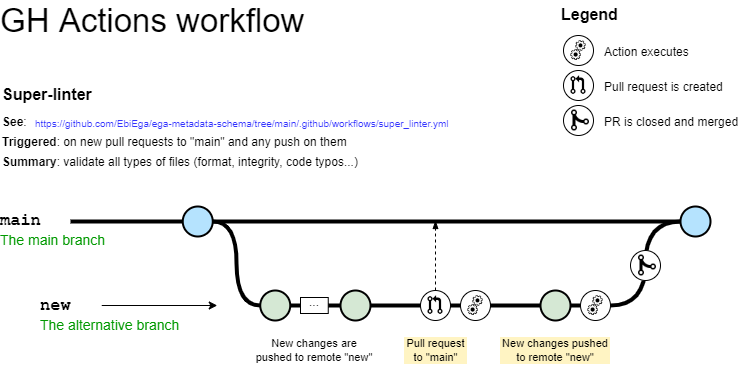
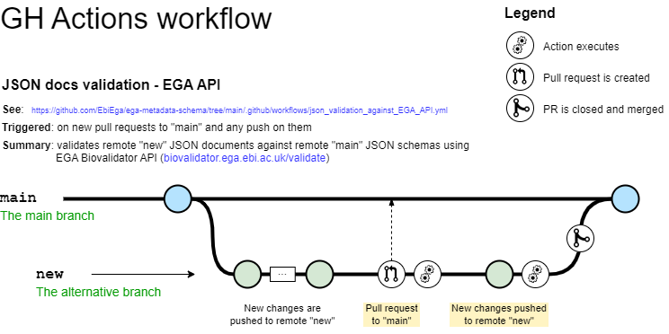
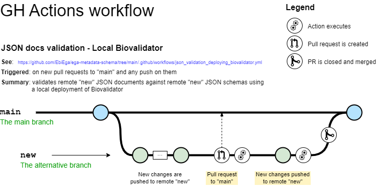
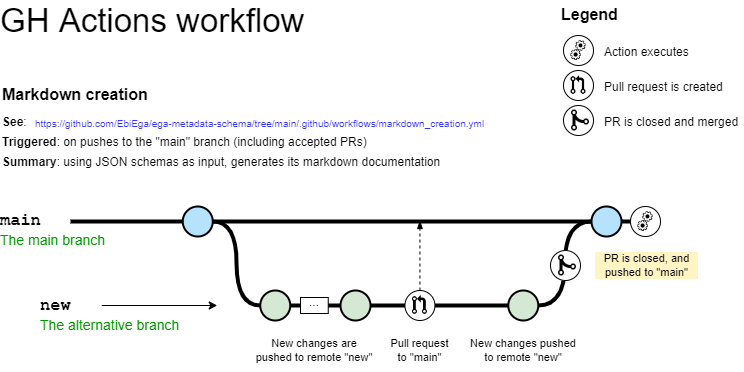

# GitHub Action workflows
EGA's metadata repository makes use of [GitHub Actions](https://docs.github.com/en/actions) in different ways, here summarized through diagrams. All workflows are stored in the [``workflows/``](../../.github/workflows/) directory and you can find documentation within each of the YAML files (one per action type).

## Super-linter

## JSON docs validation - EGA API

## JSON docs validation - Local Biovalidator

## Markdown creation
