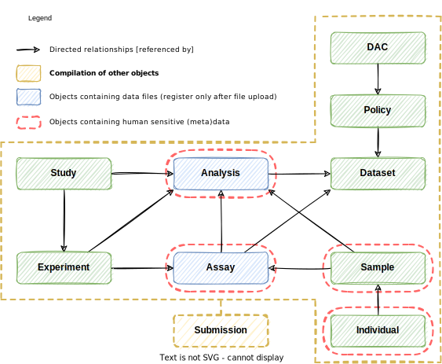

# European Genome-phenome Archive (EGA) Metadata Model
The following diagram contains the main metadata entities (i.e. objects) at EGA and their relationships. The new metadata model and its JSON schemas are in development and prone to change in the near future.

Having the upper basic diagram in mind, we can get into the details of each of these entities. Each metadata object contains, in their respective [JSON schemas](../../schemas/), the following shared nodes (not all are mandatory):
* **Object identifiers**. Allows to uniquely identify an objects instance.
* **Object title**. 
* **Object description**.
* **Schema descriptor**. Contains metadata about the schemas used to validate the JSON document.
* **Object relationships**. Contains directed and tagged relationships between instances.
* **Object attributes**. Contains custom attributes for submitters to provide.

Besides these common fields, each has their own bespoken attributes (denoted with a ``+``), visible in the following entity diagram:

